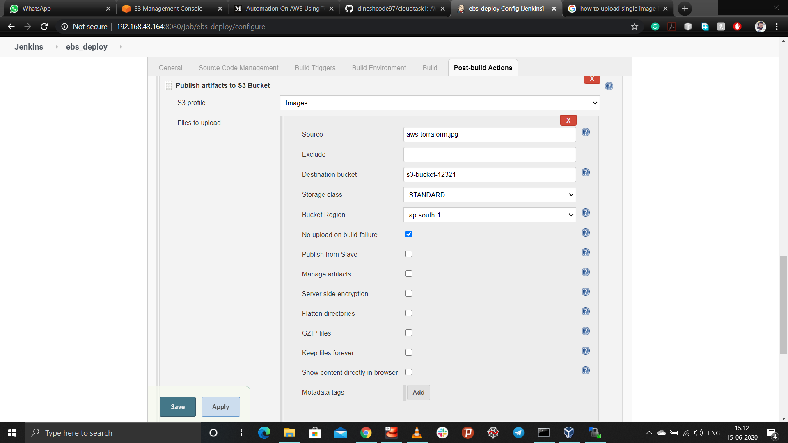
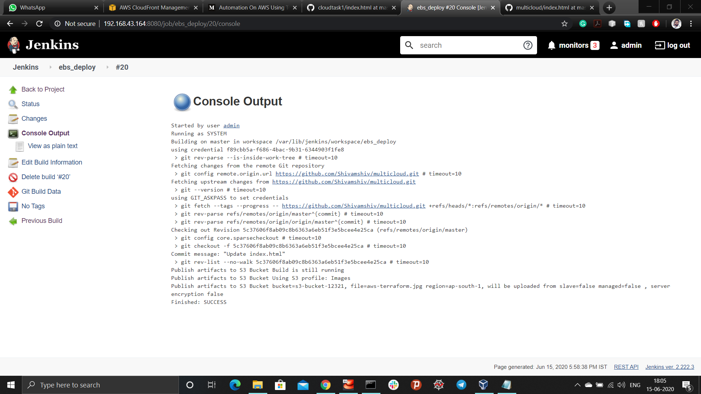
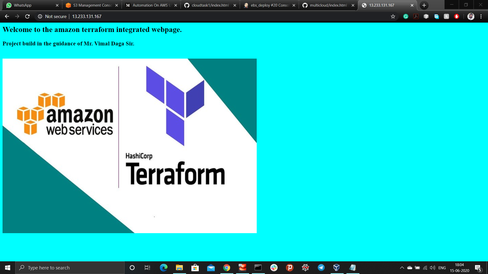
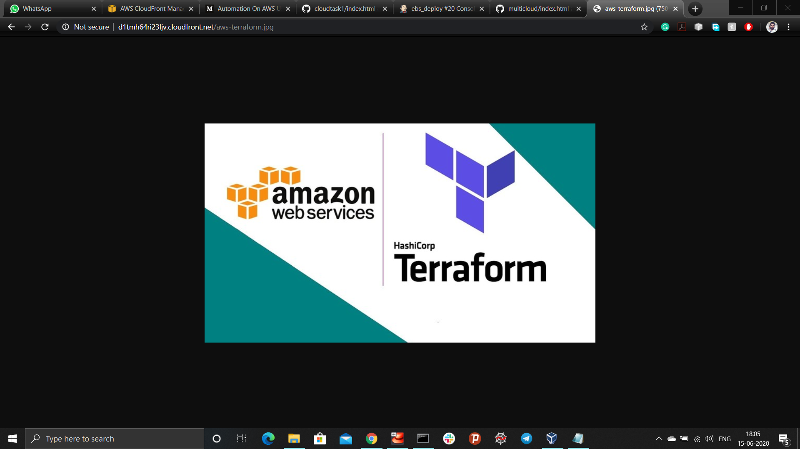

# Automate AWS services using Terraform
*This project is based on automating the aws services and building infrastructure as code(IAS) using Git, Jenkins, AWS and Terraform. This will launch the updated website through apache webserver installed in the aws-instance and fetching static data (i.e. images, videos etc.) from aws-s3-bucket.*

### What is AWS?
AWS (Amazon Web Services) is a comprehensive, evolving cloud computing platform provided by Amazon that includes a mixture of infrastructure as a service (IaaS), platform as a service (PaaS) and packaged software as a service (SaaS) offerings. AWS services can offer an organization tools such as compute power, database storage and content delivery services.

### What is Terraform?
Terraform is an open source “Infrastructure as Code” tool, created by HashiCorp. It is a declarative coding tool, Terraform enables developers to use a high-level configuration language called HCL (HashiCorp Configuration Language) to describe the desired “end-state” cloud or on-premises infrastructure for running an application. It then generates a plan for reaching that end-state and executes the plan to provision the infrastructure.

### Task Synopsis
1. Create the key and security group which allow the port 80.
2. Launch EC2 instance.
3. In this Ec2 instance use the key and security group which we have created in step 1.
4. Launch one Volume (EBS) and mount that volume into /var/www/html
5. Developer have uploded the code into github repo also the repo has some images.
6. Copy the github repo code into /var/www/html
7. Create S3 bucket, and copy/deploy the images from github repo into the s3 bucket and change the permission to public readable.
8. Create a Cloudfront using s3 bucket(which contains images) and use the Cloudfront URL to  update in code in /var/www/html
> - Those who are familiar with jenkins or are in devops AL have to integrate jenkins in this task wherever you feel can be integrated.

### Implementing Infrastructure as code
1. Create an IAM user in aws account and download the crediantals file.
2. Run the below mentioned command on the host/windows command prompt to list the profile
```
C:\Users\shivambutoniya1793>aws configure --profile IAM_username
AWS Access Key ID [****************KTDR]:
AWS Secret Access Key [****************ZUjp]:
Default region name [ap-south-1]:
Default output format [json]:
```
> - Create a separate folder for each code and create a file with extension ".tf"
3. Specify the provider for aws and initialize region and profile.
```
provider "aws" {
  region = "ap-south-1"
  profile = "shivam"
}
```
4. Create a key which will be used for the login-authentication for the system.
```
resource "tls_private_key" "terraos_key" {
algorithm = "RSA"
}

resource "aws_key_pair" "deployment_key" {
  key_name = "terraos_key"
  public_key = tls_private_key.terraos_key.public_key_openssh
  depends_on = [
    tls_private_key.terraos_key
  ]
}

resource "local_file" "key-file" {
  content = tls_private_key.terraos_key.private_key_pem
  filename = "terraoskey.pem"
  depends_on = [
    tls_private_key.terraos_key
  ]
}
```
5. Creating security-groups for aws-instance, allowing http and ssh protocol.
> - Http works on port number 80
> - SSH works on port number 22
```
resource "aws_security_group" "allow_tls" {
  name        = "allow_tls"
  description = "Allow TLS inbound traffic"
  vpc_id      = "vpc-47ebf62f"

  ingress {
    description = "HTTP"
    from_port   = 80
    to_port     = 80
    protocol    = "tcp"
    cidr_blocks = ["0.0.0.0/0"]
  }
  
  ingress {
    description = "SSH"
    from_port   = 22
    to_port     = 22
    protocol    = "tcp"
    cidr_blocks = ["0.0.0.0/0"]
  }

  egress {
    from_port   = 0
    to_port     = 0
    protocol    = "-1"
    cidr_blocks = ["0.0.0.0/0"]
  }

  tags = {
    Name = "allow_tls"
  }
}
```
6. Create an EC2 instance.
> - provide ami id (i.e. unique for each os images)
> - instance type (resources i.e. RAM, CPU etc.)
> - connection is used to provide the connection to the instance
> - Remotely installing the apache-webserver(httpd), php and git to the instance
```
resource "aws_instance" "webhttpd" {
  ami           = "ami-0447a12f28fddb066"
  instance_type = "t2.micro"
  key_name = aws_key_pair.deployment_key.key_name
  security_groups = [ "allow_tls" ]

  connection {
    type   = "ssh"
    user   = "ec2-user"
    private_key = tls_private_key.terraos_key.private_key_pem
    host   = aws_instance.webhttpd.public_ip
  }

  provisioner "remote-exec" {
    inline = [
      "sudo yum install httpd  php git -y",
      "sudo systemctl restart httpd",
      "sudo systemctl enable httpd",
    ]
  }

  tags = {
    Name = "httpdos"
  }
}
```
7. Creating a EBS (Elastic block store) volume and attaching it to the EC2 instance.
> - provide availability zone, the same in which EC2 instance is created
> - size of the volume (i.e. 1 for 1GB)
```
resource "aws_ebs_volume" "ebs" {
  availability_zone = aws_instance.webhttpd.availability_zone
  size              = 1
  tags = {
    Name = "ebs1"
  }
}

resource "aws_volume_attachment" "ebs_att" {
  device_name = "/dev/sdh"
  volume_id   = aws_ebs_volume.ebs.id
  instance_id = aws_instance.webhttpd.id
  force_detach = true
}
```
8. Printing instance public IP and storing it to the file publicip.txt
```
output "webos_ip" {
  value = aws_instance.webhttpd.public_ip
}

resource "null_resource" "nulllocal1" {
  provisioner "local-exec" {
    command = "echo  ${aws_instance.webhttpd.public_ip} > publicip.txt"
  }
}
```
9. Formatting and mounting the EBS volume to the directory /var/www/html and copying the github data in the same directory.
```
resource "null_resource" "nullremote1"  {

  depends_on = [
    aws_volume_attachment.ebs_att
  ]

  connection {
    type     = "ssh"
    user     = "ec2-user"
    private_key = tls_private_key.terraos_key.private_key_pem
    host     = aws_instance.webhttpd.public_ip
  }

  provisioner "remote-exec" {
    inline = [
      "sudo mkfs.ext4  /dev/xvdh",
      "sudo mount  /dev/xvdh  /var/www/html",
      "sudo rm -rf /var/www/html/*",
      "sudo git clone https://github.com/Shivamshiv/multicloud.git /var/www/html/"
    ]
  }
}
```
10. Creating S3 Bucket and initializing it with id
> - provide unique name to the S3 bucket as each region consists unique bucket name
> - acl(access control lists) provides type of access
```
resource "aws_s3_bucket" "s3-bucket-12321" {
  depends_on = [
    aws_instance.webhttpd
  ]

  bucket = "s3-bucket-12321"
  acl    = "public-read"
  region = "ap-south-1"
  tags = {
    Name = "my_bucket"
    Environment = "Deployment"
  }
}

locals {
  s3_origin_id = "S3-s3-bucket-12321"
}
```
11. Manages S3 bucket-level Public Access Block configuration and provides settings for access points, buckets, and accounts to help you manage public access to Amazon S3 resources
```
resource "aws_s3_bucket_public_access_block" "s3-bucket-12321_public" {
  bucket = "s3-bucket-12321"
  block_public_acls   = false
  block_public_policy = false
}
```
12. Creating origin access identity
```
resource "aws_cloudfront_origin_access_identity" "origin_access_identity" {
  comment = "Some comment"
}
```
13. Creating cloud-front distribution and connecting it to the S3 bucket
```
resource "aws_cloudfront_distribution" "s3-12321-cloud-front" {

  origin {
    domain_name = aws_s3_bucket.s3-bucket-12321.bucket_regional_domain_name
    origin_id   = local.s3_origin_id
 
    s3_origin_config {
      origin_access_identity = aws_cloudfront_origin_access_identity.origin_access_identity.cloudfront_access_identity_path
    }

  }

  enabled             = true
  is_ipv6_enabled     = true

  default_cache_behavior {
    allowed_methods  = ["DELETE", "GET", "HEAD", "OPTIONS", "PATCH", "POST", "PUT"]
    cached_methods   = ["GET", "HEAD"]
    target_origin_id = local.s3_origin_id

    forwarded_values {
      query_string = false

      cookies {
        forward = "none"
      }
    }

    viewer_protocol_policy = "allow-all"
    min_ttl                = 0
    default_ttl            = 3600
    max_ttl                = 86400
  }

  restrictions {
    geo_restriction {
      restriction_type = "blacklist"
      locations        = ["AF", "DZ", "AD", "AX"]
    }
  }

  viewer_certificate {
    cloudfront_default_certificate = true
  }
}
```
14. Generates an IAM policy document in JSON format.
```
data "aws_iam_policy_document" "s3_bucket_policy" {
  statement {
    actions   = ["s3:GetObject"]
    resources = ["${aws_s3_bucket.s3-bucket-12321.arn}/*"]


    principals {
      type        = "AWS"
      identifiers = ["${aws_cloudfront_origin_access_identity.origin_access_identity.iam_arn}"]
    }
  }
}
```
15. Attaches a policy to an S3 bucket resource.
```
resource "aws_s3_bucket_policy" "example" {
  bucket = "s3-bucket-12321"
  policy = data.aws_iam_policy_document.s3_bucket_policy.json
}
```
#### Now integrating aws with jenkins to fetch the static data in the S3 bucket from Github repository
16. Install the S3 publisher plugins in the jenkins
> - manage jenkins -> manage plugins -> S3 publisher
17. Configuring the S3 profiles in the jenkins
> - manage jenkins -> configure system -> s3 profiles

18. Creating a job to copy github static data to the S3 bucket
> - provide destination(path) to the source, where your images are saved
> - name of the bucket in the destination bucket
> - provide region in the bucket region

19. Now, run the infrastructure and job in the jenkins
> - terraform validate (to validate the syntax of the code)
> - terraform init (to install the required plugins)
> - terraform apply (to deploy the infrastructure as code)


- Browse public ip in the browser


- Accessing static data using CloudFront


- To destroy the entire infrastructure
> - terraform destroy

- **Note:** Further development and integration is in progress.
